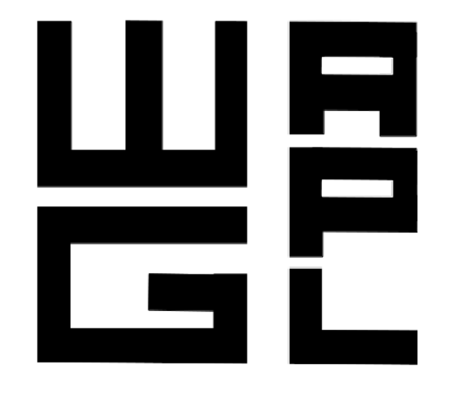

   

 

My name is Thomas Wood and I am the principal research scientist at an applied physics laboratory which does research in artificial intelligence and robotics.

---

  <ul class="posts">
    
      <li>
        {{ post.date | date: "%b %-d, %Y" }}
        <a class="post-link" href="{{ post.url | prepend: site.baseurl }}">  {{ post.title }}</a>  {{ post.excerpt }}
      </li>
    
  </ul>

<!-- ---
layout: page
title: Willkommen in der Laboratorium!
tagline: Research Blog of [WG-APL](https://github.com/wgapl)
---
 -->

<!-- Read [Jekyll Quick Start](http://jekyllbootstrap.com/usage/jekyll-quick-start.html)

Complete usage and documentation available at: [Jekyll Bootstrap](http://jekyllbootstrap.com)

## Update Author Attributes

In `_config.yml` remember to specify your own data:

    title : My Blog =)

    author :
      name : Name Lastname
      email : blah@email.test
      github : username
      twitter : username

The theme should reference these variables whenever needed.

## Sample Posts

This blog contains sample posts which help stage pages and blog data.
When you don't need the samples anymore just delete the `_posts/core-samples` folder.

    $ rm -rf _posts/core-samples

Here's a sample "posts list".

<ul class="posts">
  
    <li>{{ post.date | date_to_string }} &raquo; <a href="{{ BASE_PATH }}{{ post.url }}">{{ post.title }}</a></li>
  
</ul>

## To-Do

This theme is still unfinished. If you'd like to be added as a contributor, [please fork](http://github.com/plusjade/jekyll-bootstrap)!
We need to clean up the themes, make theme usage guides with theme-specific markup examples.
 -->
